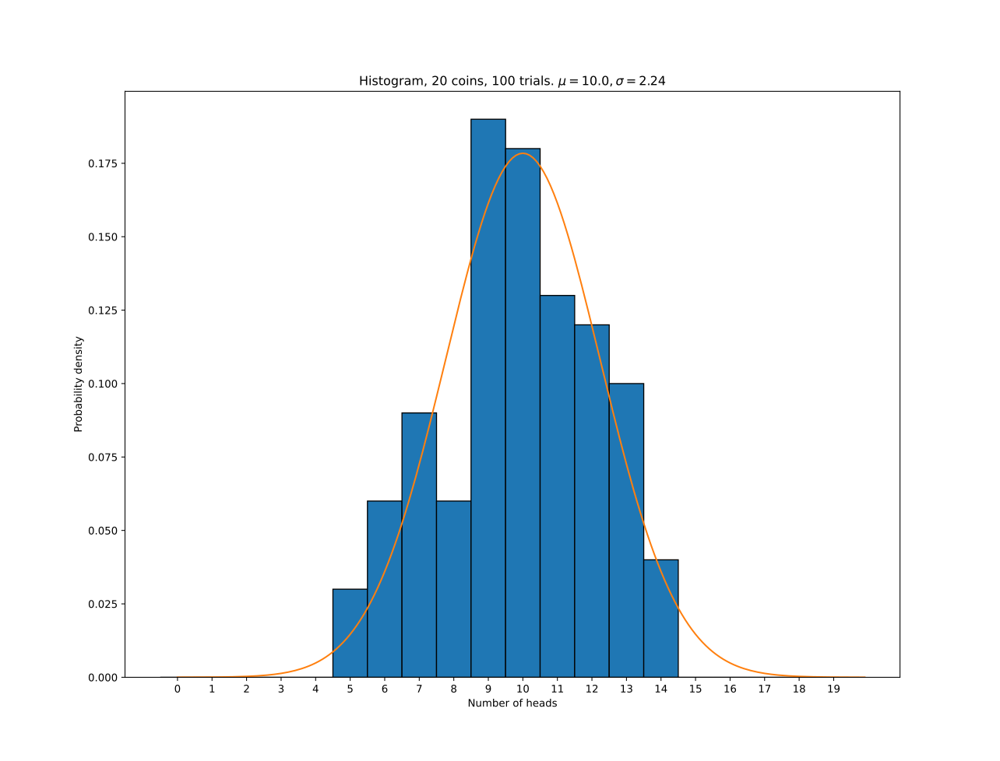

# Coin tossing

This program simulates discrete events like coin tossing with either a binomial
or Poisson PDF. Random sampling is done with numpy, then a histogram is plotted
together with (optionally) the actual PDF.

## Settings

These values are found in `settings.json`.

| Name           | Type  | Description                                                                                                                         |
|----------------|-------|-------------------------------------------------------------------------------------------------------------------------------------|
| N              | int   | Number of discrete events to simulate.                                                                                              |
| trials         | int   | Number of trials to perform.                                                                                                        |
| p              | float | Probability of event.                                                                                                               |
| plotExact      | bool  | If true, plots the actual PDF on top of the histogram.                                                                              |
| binomOrPoisson | bool  | If true, a binomial sampling is used and a normal PDF is plotted. If false, a poisson sampling is used and the poisson PDF is plot. |
| step           | float | The x-axis resolution of the PDF plot. Setting this higher makes the graph chunky. Setting it lower makes it smoother.              |
