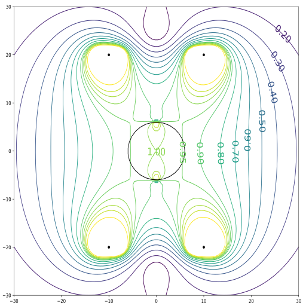

# Helmholtz

Simulates a Helmholtz coil with an optional magnetic dipole (just acurrent loop)
in the middle. Plots both contours (as above) and 3D field plots. It gets fun 
when you turn the dipole's strength up. Screenshots available in `img/`.

Another point of interest: this script demonstrates a way to plot colored quiver
plots in matplotlib.

## Configuration

Edit `settings.json`. Do not remove any entries, no error handling is provided.
The parameters are fairly self-explanatory, and the code is commented if you
want to know exactly what they do. The most important is probably the `plot?`
field, which when set to 1, plots that specific type of graph.

## Usage

To launch the script: `python helmholtz.py`

The plots are saved in the same folder as the script.

The 2D plots still calculate the whole 3D field before drawing. This is quite
inefficient but it still works reasonably fine `div = 100` (so 1000000 points),
runs in a few seconds.
You won't be able to pull it off with the 3D plot though, the default `div = 10`
works just fine for visualization. The reason is the 3D projection runs on CPU
(I think) and takes ages. Furthermore the exported `.svg` is completely unusable
due to the amount of data points.

## Credits

Greatly inspired by [this page on Wikipedia](https://commons.wikimedia.org/wiki/File:Helmholtz_coil,_B_magnitude_cross_section.svg).
